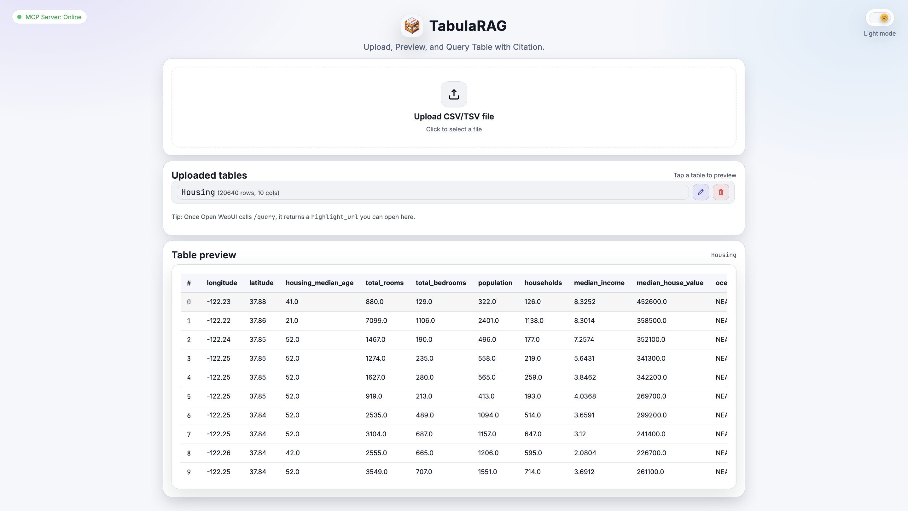
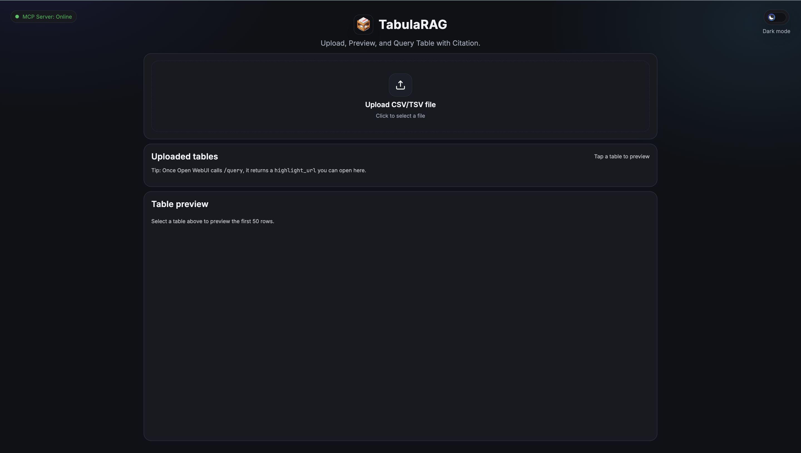
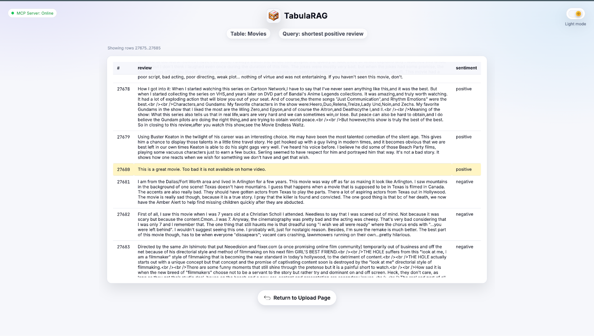
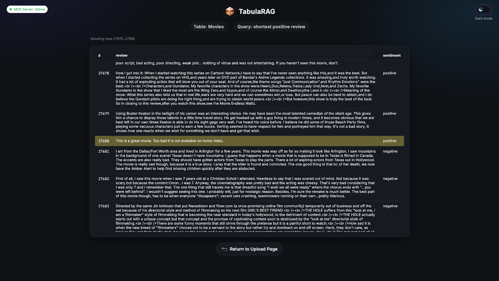
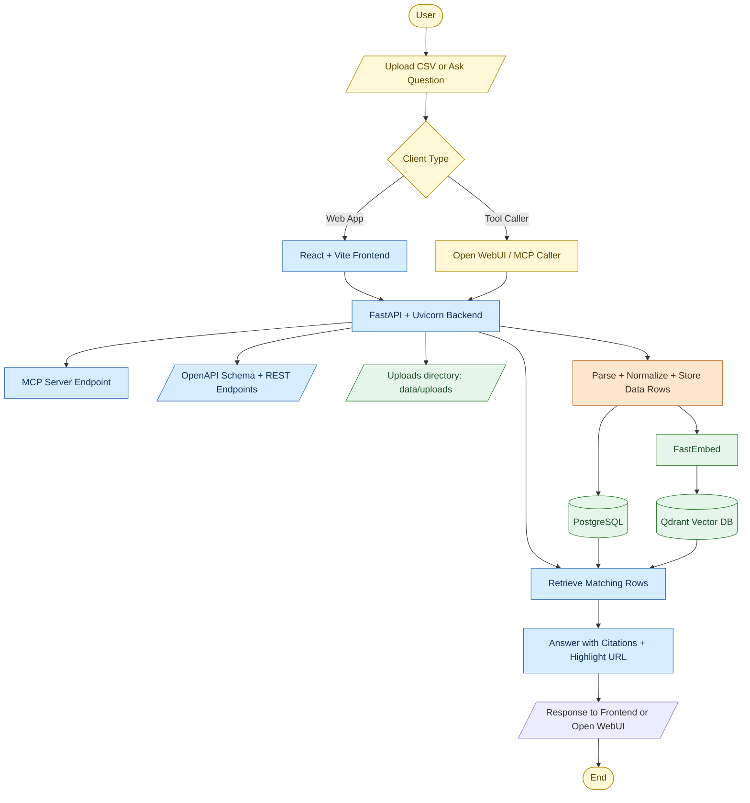

<div align="center">
  
  <h1>TabulaRAG</h1>
  A fast-ingesting tabular data MCP RAG tool backed with cell citations.
</div>

## UI Preview
<table>
  <tr>
    <td></td>
    <td></td>
  </tr>
  <tr>
    <td></td>
    <td></td>
  </tr>
</table>

## Tech Stack

- Backend: Python 3.11, FastAPI, Uvicorn, SQLAlchemy, PostgreSQL, Qdrant, MCP, OpenAPI
- Frontend: TypeScript, React, Vite

## Prerequisites

- Docker Engine / Docker Desktop
- Docker Compose (v2)
- Optional for local dev: Python 3.11+, Node.js 18+

## Getting started

1. Build and start all services:

```bash
docker compose up --build
```

2. Open the app in your browser:
Frontend: `http://localhost:5173`
Backend API: `http://localhost:8000`

3. Stop everything:

```bash
docker compose down
```

## Integrations

### MCP (Model Context Protocol)

1. Start the stack (see Getting started).

2. Confirm the MCP server is online:
`http://localhost:8000/mcp-status` should return `{"status":"online"}`.

3. In your MCP client, add a server using Streamable HTTP transport:
URL: `http://localhost:8000/mcp`

4. Verify the tools are available:
`ping`, `list_tables`, `get_table_slice`.

### OpenAPI tool (Open WebUI integration)

1. Start the stack (see Getting started).

2. Open the interactive docs or download the schema:
Docs: `http://localhost:8000/docs`
Schema: `http://localhost:8000/openapi.json`

3. Import the OpenAPI schema into your tool system and set the base URL:
`http://localhost:8000`

4. Recommended endpoints:
`POST /upload`, `GET /tables`, `POST /query`, `GET /highlights/{highlight_id}`.

## High-level Architecture



